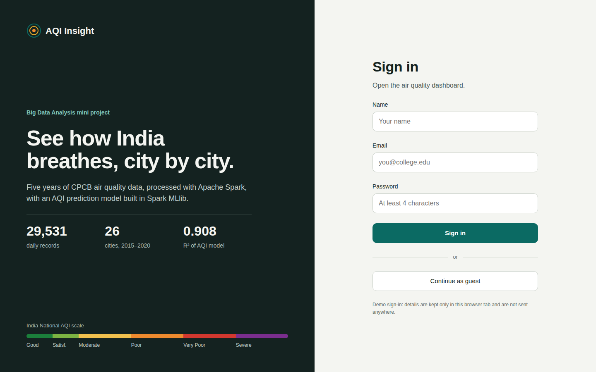
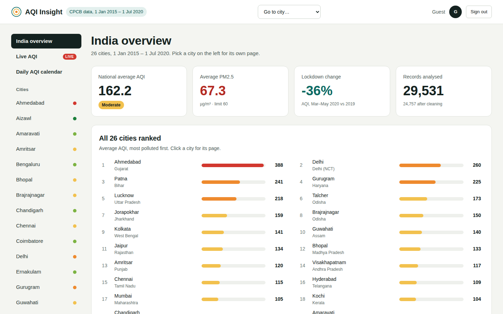
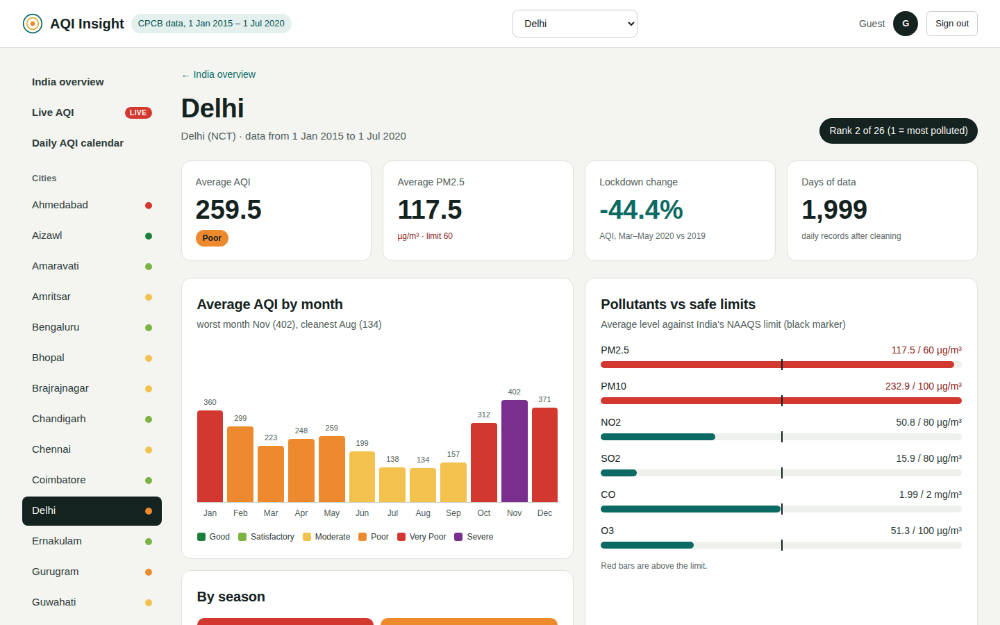
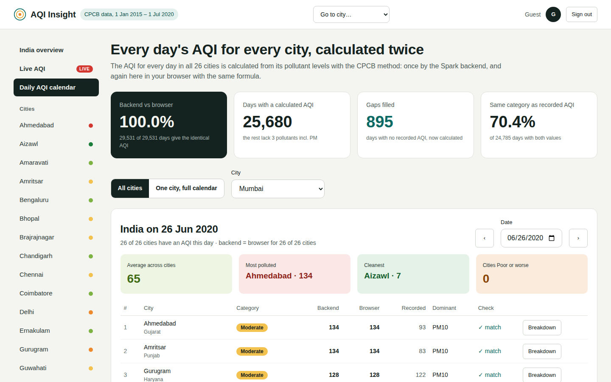

# Big Data Analysis of Air Quality in Indian Cities

### Hadoop HDFS · Apache Spark · Spark SQL · Spark MLlib


[](https://katkarvismaya19-web.github.io/aqi-bigdata-india/)

An end-to-end big data pipeline for **29,531 daily air quality records from 26 Indian cities (2015–2020)**. The raw data is stored in **Hadoop HDFS**, processed with **Apache Spark**, analysed with **Spark SQL**, and used to train and compare four **Spark MLlib** models that predict the Air Quality Index (AQI). Processed data is written back to HDFS as Parquet, and the results are published in an interactive dashboard with live AQI for every city.

**[▶ Open the live dashboard](https://katkarvismaya19-web.github.io/aqi-bigdata-india/)** (click *Continue as guest*)

---

## Contents

- [Highlights](#highlights)
- [Architecture](#architecture)
- [Big data concepts applied](#big-data-concepts-applied)
- [Key results](#key-results)
- [Tech stack](#tech-stack)
- [Quick start](#quick-start)
- [Running on Hadoop (HDFS) with Docker](#running-on-hadoop-hdfs-with-docker)
- [Running locally without Hadoop](#running-locally-without-hadoop)
- [Pipeline modules](#pipeline-modules)
- [The dashboard](#the-dashboard)
- [How the AQI is calculated](#how-the-aqi-is-calculated)
- [Results](#results)
- [Screenshots](#screenshots)
- [Repository structure](#repository-structure)
- [Troubleshooting](#troubleshooting)
- [Limitations and future work](#limitations-and-future-work)
- [Data source and references](#data-source-and-references)
- [Author](#author)

---

## Highlights

- **Hadoop + Spark pipeline:** the dataset lives in HDFS (NameNode + DataNode in Docker). Spark reads it from `hdfs://`, processes it, and writes the cleaned data and daily AQI back to HDFS as Parquet, partitioned by city.
- **Spark SQL analytics:** city rankings, yearly, monthly and seasonal trends, AQI category distribution, and the impact of the 2020 COVID-19 lockdown.
- **Machine learning with MLlib:** four regression models compared on a held-out test set. Random Forest predicts AQI with **R² = 0.908**.
- **CPCB AQI engine:** every city-day's AQI is recalculated from raw pollutant levels with India's official sub-index method, filling **895 days** that had no recorded AQI.
- **Verified end to end:** the dashboard recalculates all 29,531 days in the browser and matches the Spark output on **100%** of them.
- **Live AQI:** current air quality for all 26 cities, converted to India's AQI with the same CPCB formula.
- **Deployed:** the dashboard is hosted on GitHub Pages and redeploys on every push.

## Architecture

```
  city_day.csv (CPCB via Kaggle)
          │  hdfs dfs -put
          ▼
 ┌──────────────────────────────┐
 │  Hadoop HDFS                 │   NameNode + DataNode (Docker)
 │  /aqi/city_day.csv           │
 └──────────────┬───────────────┘
                │  spark.read.csv("hdfs://namenode:9000/aqi/city_day.csv")
                ▼
 ┌──────────────────────────────┐
 │  Apache Spark 4.2            │
 │  ingestion → cleaning        │   distributed DataFrames, cached in memory
 │  (Year / Month / Season)     │
 └───┬──────────┬───────────┬───┘
     ▼          ▼           ▼
 Spark SQL   MLlib models  CPCB daily AQI
 analysis    (4 models)    (sub-index method)
     └──────────┬───────────┘
                ├──────────────────────────────▶ HDFS /aqi/output/
                │                                 clean_city_day/  (Parquet)
                │                                 daily_aqi/       (Parquet, by city)
                ▼
 outputs/  charts, results.json, daily_aqi.csv, dashboard_data.json, daily_aqi_web.json
                │
                ▼
 Web dashboard (GitHub Pages) ◀──── live pollutant levels (Open-Meteo / CAMS),
                                     converted with the same CPCB formula
```

## Big data concepts applied

| Concept | How it is used in this project |
| --- | --- |
| Distributed storage (HDFS) | The raw CSV is stored in Hadoop HDFS and read by Spark from `hdfs://namenode:9000/aqi/city_day.csv` |
| Columnar storage (Parquet) | The cleaned data and daily AQI are written back to HDFS as Snappy-compressed Parquet; the daily AQI is partitioned by city, so a query for one city reads only that city's files |
| Distributed DataFrames | Data is loaded into Spark DataFrames with an inferred schema; transformations run in parallel across partitions |
| Lazy evaluation and caching | Transformations build an execution plan that runs only when a result is needed; the cleaned dataset is cached in memory and reused by every module |
| Spark SQL | DataFrames are registered as temporary views and queried with SQL, including aggregations, grouping and window functions |
| Distributed feature engineering | Year, Month and Season, and every pollutant's CPCB sub-index, are computed as column expressions over the full dataset |
| MLlib pipelines | Imputer → VectorAssembler → regressor, chained in a Spark ML Pipeline, trained on an 80/20 random split and evaluated with RMSE, MAE and R² |
| Model comparison | Linear Regression, Decision Tree, Random Forest and Gradient Boosted Trees, with feature importances from the tree models |
| Statistical analysis | Pearson correlation of each pollutant with AQI, computed in Spark |
| Configurable execution | The data path, Spark master and driver memory come from environment variables, so the same code runs on HDFS or on a local file |
| Containerised infrastructure | Docker Compose starts the HDFS cluster and a Spark container with a single command |

## Key results

| Finding | Result |
| --- | --- |
| Most polluted major cities | Delhi (avg AQI 259.5), Patna (240.8), Gurugram (225.1), Lucknow (218.0) |
| Cleanest cities | Aizawl (34.8), Shillong (53.8), Coimbatore (73.0) |
| Worst months | November (229.4), December (224.5), January (223.6) |
| Worst season | Winter (213.8); cleanest is Monsoon (115.3) |
| COVID-19 lockdown (25 Mar–31 May, 2020 vs 2019) | AQI −36%, PM2.5 −38%, NO2 −43% |
| Pollutant most linked to AQI | PM2.5 (correlation 0.73) |
| Best prediction model | Random Forest: R² 0.908, RMSE 37.34, MAE 21.76 |
| Daily AQI coverage (CPCB method) | 25,680 of 29,531 city-days |
| Calculated vs recorded AQI | Correlation 0.884; same category on 70.5% of days |
| Spark backend vs browser AQI | Identical on 29,531 of 29,531 days |

> Ahmedabad has the highest average AQI (388.3), but this is driven by unusually high CO readings (18.65 mg/m³, about nine times Delhi's level), which points to a likely sensor or reporting issue.

## Tech stack

| Layer | Tools |
| --- | --- |
| Storage | Hadoop HDFS 3.2 (NameNode + DataNode), Parquet |
| Processing | Apache Spark 4.2 (PySpark), Spark SQL |
| Machine learning | Spark MLlib (Pipeline, Imputer, VectorAssembler, 4 regressors) |
| Analysis and charts | Python, pandas, Matplotlib, Seaborn, Jupyter |
| Infrastructure | Docker, Docker Compose |
| Dashboard | HTML, CSS, JavaScript (no framework) |
| Live data | Open-Meteo Air Quality API (CAMS forecast), no API key |
| Hosting | GitHub Pages |

## Quick start

| I want to… | Do this |
| --- | --- |
| See the results | Open the **[live dashboard](https://katkarvismaya19-web.github.io/aqi-bigdata-india/)** |
| Run the dashboard on my machine | `python run_dashboard.py` (the results are already in `outputs/`) |
| Run the full pipeline on Hadoop | Follow [Running on Hadoop (HDFS) with Docker](#running-on-hadoop-hdfs-with-docker) |
| Run the pipeline without Hadoop | Follow [Running locally without Hadoop](#running-locally-without-hadoop) |

Both pipeline options need `city_day.csv` from Kaggle, [Air Quality Data in India (2015–2020)](https://www.kaggle.com/datasets/rohanrao/air-quality-data-in-india), placed in the `data/` folder. See [`data/README.md`](data/README.md).

```bash
git clone https://github.com/katkarvismaya19-web/aqi-bigdata-india.git
cd aqi-bigdata-india
```

## Running on Hadoop (HDFS) with Docker

This is the main way to run the project. It needs only [Docker Desktop](https://www.docker.com/products/docker-desktop/); Java, Spark and Hadoop all run inside containers. Run every command from the repo root.

**1. Start HDFS**

```bash
docker compose -f hadoop/docker-compose.yml up -d namenode datanode
docker exec namenode hdfs dfsadmin -safemode wait
```

**2. Load the dataset into HDFS**

```bash
docker exec namenode hdfs dfs -mkdir -p /aqi
docker exec namenode hdfs dfs -put -f /data/city_day.csv /aqi/
docker exec namenode hdfs dfs -ls /aqi
```

**3. Run the Spark pipeline against HDFS**

```bash
docker compose -f hadoop/docker-compose.yml run --rm spark
```

The first run builds the Spark image, which takes a few minutes. The log shows `Reading data from: hdfs://namenode:9000/aqi/city_day.csv (HDFS)` and ends with `Wrote Parquet to HDFS` and `Done. Charts saved in outputs`.

**4. Check the output in HDFS**

```bash
docker exec namenode hdfs dfs -ls -R /aqi/output
```

The HDFS web interface is at **http://localhost:9870** (Utilities → Browse the file system → `/aqi`).

**5. Stop the cluster**

```bash
docker compose -f hadoop/docker-compose.yml down
```

HDFS data is kept in Docker volumes between runs; `down -v` deletes it.

| Container | Role |
| --- | --- |
| `namenode` | HDFS NameNode: file system metadata, web UI on port 9870 |
| `datanode` | HDFS DataNode: stores the data blocks (replication factor 1) |
| `spark` | Spark 4.2 + Python 3.11 + Java 17; runs `src/aqi_project.py` against HDFS |

## Running locally without Hadoop

Requires Python 3.10+ and Java 17+ (for Spark 4.x).

```bash
python -m venv .venv
```

| Shell | Activate |
| --- | --- |
| Windows PowerShell | `.venv\Scripts\Activate.ps1` |
| Windows Command Prompt | `.venv\Scripts\activate.bat` |
| macOS / Linux | `source .venv/bin/activate` |

```bash
pip install -r requirements.txt
python src/aqi_project.py
python run_dashboard.py
```

On Windows PowerShell, run `$env:PYSPARK_PYTHON = "python"` before the pipeline. The pipeline takes 3–5 minutes and reads `data/city_day.csv` directly. The dashboard opens at **http://localhost:8000/dashboard/**.

To run the pipeline step by step instead, open `notebooks/AQI_BigData_Project.ipynb` in Jupyter or Google Colab.

| Environment variable | Default | Purpose |
| --- | --- | --- |
| `AQI_DATA_PATH` | `data/city_day.csv` | Input file; an `hdfs://` path switches on the HDFS Parquet output |
| `SPARK_MASTER` | `local[*]` | Spark master |
| `SPARK_DRIVER_MEMORY` | `4g` | Driver memory (Random Forest needs more than the 1 GB default) |

## Pipeline modules

| Module | Description |
| --- | --- |
| 1. Ingestion | Reads the CSV from HDFS (or a local file) into a Spark DataFrame with an inferred schema |
| 2. Cleaning | Removes duplicates and invalid readings; adds Year, Month and Season; caches the result |
| 3. Spark SQL analysis | City rankings, trends, seasonal patterns, AQI categories, metro comparison |
| 4. Lockdown impact | Compares 25 Mar–31 May 2020 with the same period in 2019, overall and per city |
| 5. Correlation | Pearson correlation of each pollutant with AQI |
| 6. MLlib prediction | Linear Regression, Decision Tree, Random Forest, Gradient Boosted Trees |
| 7. Daily AQI | CPCB sub-indices for every city-day; AQI = highest sub-index; dominant pollutant |
| 8. Export | Parquet to HDFS; charts, `results.json` and dashboard data to `outputs/` |

## The dashboard

| Page | What it shows |
| --- | --- |
| India overview | National KPIs, all 26 cities ranked, pollution drivers, regional comparison, monthly pattern, AQI category share, lockdown impact, model comparison |
| City pages (26) | Rank, monthly, seasonal and yearly AQI, pollutants against safe limits, category share, record days, lockdown effect, health advice, and a live AQI card |
| Live AQI | Current AQI for all 26 cities, ranked, with the pollutant breakdown, the last 24 hours, a city selector and refresh |
| Daily AQI calendar | Every city on any date, a month grid of all cities, a full-year calendar for one city, and a per-day breakdown of how the AQI was calculated |
| AQI calculator | Enter pollutant levels and get the AQI, category and dominant pollutant instantly; can be filled from any day or from live data |

A **Go to city** dropdown in the top bar opens any city's page from anywhere, and the layout adapts to mobile. All historical numbers come from the files produced by the Spark pipeline; only the Live AQI page fetches outside data.

## How the AQI is calculated

The pipeline follows the CPCB National Air Quality Index method:

1. Each pollutant concentration (PM2.5, PM10, NO2, SO2, CO, O3, NH3) is converted to a **sub-index** by linear interpolation within its CPCB breakpoint band:

   `I = I_lo + (C − C_lo) × (I_hi − I_lo) / (C_hi − C_lo)`

2. The **AQI is the highest sub-index**, and that pollutant is the dominant one.
3. An AQI is reported only when **at least three pollutants** are available and one of them is **PM2.5 or PM10**.

| AQI | Category | PM2.5 (µg/m³) | PM10 (µg/m³) |
| --- | --- | --- | --- |
| 0–50 | Good | 0–30 | 0–50 |
| 51–100 | Satisfactory | 31–60 | 51–100 |
| 101–200 | Moderate | 61–90 | 101–250 |
| 201–300 | Poor | 91–120 | 251–350 |
| 301–400 | Very Poor | 121–250 | 351–430 |
| 401–500 | Severe | 250+ | 430+ |

The calculated AQI correlates at 0.884 with the AQI recorded by CPCB. They differ on some days because CPCB uses hourly data, while this dataset has daily averages.

**Live AQI** uses hourly pollutant levels for the last 48 hours and follows CPCB averaging: 24-hour means for PM2.5, PM10, NO2 and SO2 (at least 16 of 24 hours), and the highest 8-hour mean for CO and O3 (at least 6 of 8 hours).

## Results

| | |
| --- | --- |
|  |  |
|  |  |


## Screenshots

| | |
| --- | --- |
|  |  |
|  |  |

## Repository structure

```
aqi-bigdata-india/
├── README.md
├── index.html                    # public landing page (findings, city ranking, search-engine metadata)
├── sitemap.xml                   # for Google Search Console
├── requirements.txt
├── run_dashboard.py              # serves the dashboard locally
├── hadoop/
│   ├── docker-compose.yml        # HDFS NameNode + DataNode, and the Spark container
│   ├── hadoop.env                # HDFS configuration
│   └── Dockerfile                # Spark 4.2 + Python 3.11 + Java 17 image
├── src/
│   └── aqi_project.py            # the full Spark pipeline (modules 1–8)
├── notebooks/
│   └── AQI_BigData_Project.ipynb # the pipeline step by step
├── dashboard/
│   ├── index.html
│   ├── app.js                    # pages, charts, live AQI and the in-browser AQI engine
│   └── style.css
├── outputs/
│   ├── 01_city_avg_aqi.png … 08_daily_aqi_check.png
│   ├── results.json              # every number from the pipeline run
│   ├── dashboard_data.json       # data shown by the dashboard
│   ├── daily_aqi.csv             # calculated AQI for every city-day
│   └── daily_aqi_web.json        # every city-day in compact form, for the Daily AQI page
├── data/
│   └── README.md                 # how to download city_day.csv
└── docs/
    └── screenshots/
```

## Troubleshooting

| Problem | Solution |
| --- | --- |
| `docker exec namenode ...` says the container is not running | Start Docker Desktop, then run `docker compose -f hadoop/docker-compose.yml up -d namenode datanode` again. |
| `hdfs dfs -put` fails with *There are 0 datanode(s) running* | The DataNode is still starting. Wait 30 seconds and retry; check with `docker logs datanode`. |
| Spark container stops with an out-of-memory error | Give Docker Desktop more memory (Settings → Resources), or set `SPARK_DRIVER_MEMORY` to `2g` in `hadoop/docker-compose.yml`. |
| `java.lang.OutOfMemoryError: Java heap space` (local run) | Close other applications, or set `SPARK_DRIVER_MEMORY=3g`. |
| Warnings about `winutils.exe`, `NativeCodeLoader`, `netlib-blas` or `libopenblas` | Expected; they do not affect results. |
| Dashboard shows **Results not found** | Make sure `outputs/dashboard_data.json` and `outputs/daily_aqi_web.json` exist, and start it with `python run_dashboard.py`. |
| Dashboard is blank when opening `index.html` directly | Browsers block local file access. Use `python run_dashboard.py`. |
| Live AQI shows *Live data unavailable* | Needs an internet connection to reach Open-Meteo. Click **Try again**, or check that a browser extension is not blocking it. |
| `running scripts is disabled on this system` (PowerShell) | Run `Set-ExecutionPolicy -Scope CurrentUser RemoteSigned`, then activate the environment again. |

## Limitations and future work

**Limitations**

- Many readings are missing (up to 61% for Xylene), and imputed values add uncertainty.
- Cities joined the monitoring network in different years, so all-city averages over time must be read with care.
- Some stations report doubtful values, such as Ahmedabad's CO readings.
- The Hadoop cluster is single-node (one NameNode, one DataNode), and Spark runs in local mode inside its container.
- The historical analysis covers January 2015 to July 2020. Live AQI uses modelled estimates (CAMS, about 40 km resolution), not CPCB station readings.

**Future work**

- **Multi-node cluster:** Spark on YARN across several machines, with HDFS replication greater than 1.
- **Real-time streaming:** Apache Kafka and Spark Structured Streaming, with alerts when AQI crosses 200.
- **Official live data:** CPCB's real-time station feed on data.gov.in.
- **Forecasting:** next-day AQI with time-series models (ARIMA, LSTM) or lag features.
- **Weather data:** temperature, wind speed, humidity and rainfall, which strongly affect pollution.

## Data source and references

1. Vopani (Rohan Rao), *Air Quality Data in India (2015–2020)*, Kaggle, compiled from Central Pollution Control Board (CPCB) data.
2. Central Pollution Control Board, *National Air Quality Index*, Ministry of Environment, Forest and Climate Change, Government of India, 2014.
3. M. Zaharia et al., "Apache Spark: A Unified Engine for Big Data Processing," *Communications of the ACM*, vol. 59, no. 11, 2016.
4. K. Shvachko et al., "The Hadoop Distributed File System," *Proc. IEEE MSST*, 2010.
5. X. Meng et al., "MLlib: Machine Learning in Apache Spark," *Journal of Machine Learning Research*, vol. 17, 2016.
6. M. Armbrust et al., "Spark SQL: Relational Data Processing in Spark," *Proc. ACM SIGMOD*, 2015.
7. L. Breiman, "Random Forests," *Machine Learning*, vol. 45, 2001.
8. Live air quality: [Open-Meteo](https://open-meteo.com/) Air Quality API, using the Copernicus Atmosphere Monitoring Service (CAMS) global forecast.

The dataset is not redistributed in this repository; check its licence on Kaggle before sharing it.

## Author

**Vismaya Katkar** · Big Data Analysis mini project

[GitHub](https://github.com/katkarvismaya19-web) · [LinkedIn](https://www.linkedin.com/in/vismaya-katkar-22808b278/)
