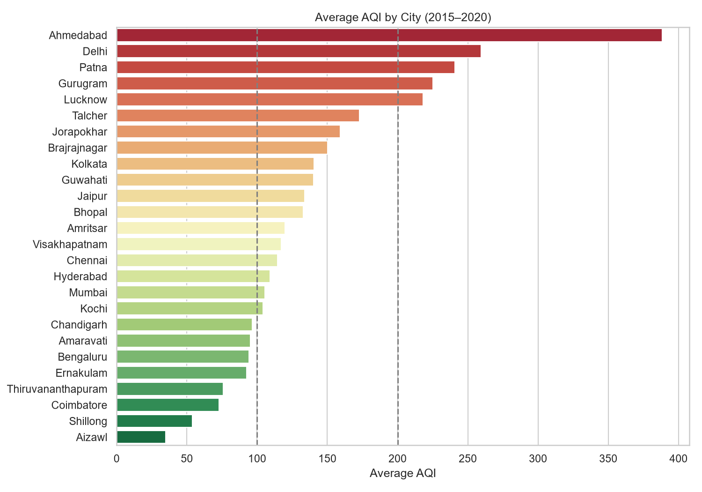
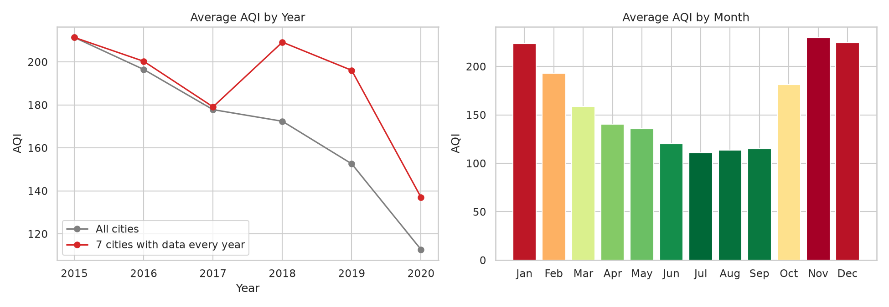
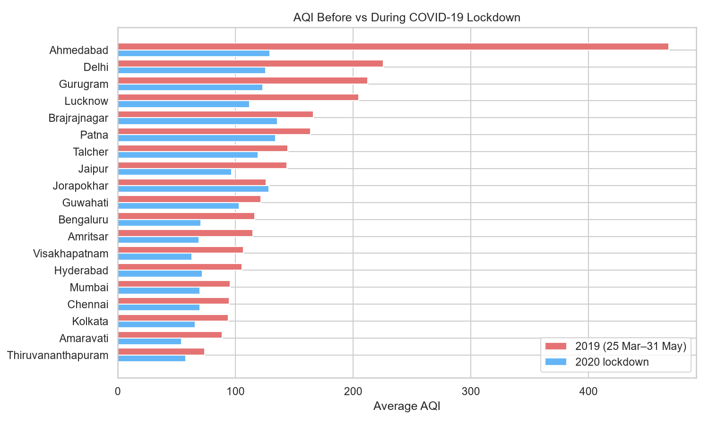
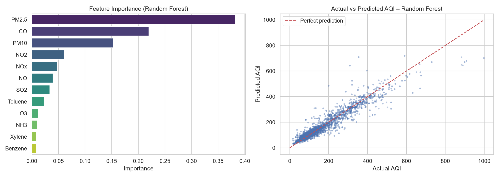
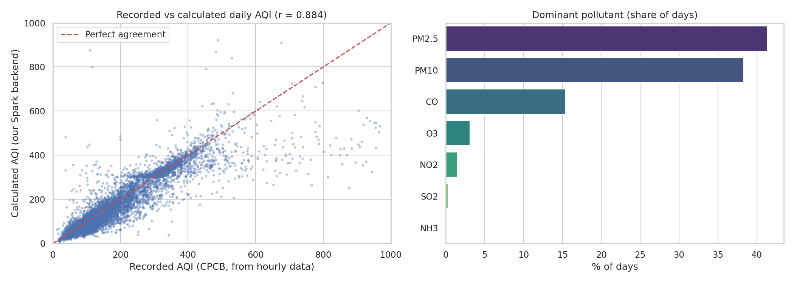

# Big Data Analysis of Air Quality in Indian Cities and AQI Prediction using Apache Spark

Vismaya Katkar

This project processes 29,531 days of air quality data from 26 Indian cities (2015–2020) with **Apache Spark**.
It analyses pollution patterns with **Spark SQL**, predicts the Air Quality Index (AQI) with **Spark MLlib**,
and calculates every day's AQI from pollutant levels using the official **CPCB method**.

## Key results

| Finding | Result |
| --- | --- |
| Most polluted major cities | Delhi (avg AQI 259.5), Patna (240.8), Gurugram (225.1), Lucknow (218.0) |
| Cleanest cities | Aizawl (34.8), Shillong (53.8), Coimbatore (73.0) |
| Worst months | November (229.4), December (224.5), January (223.6) |
| COVID-19 lockdown (25 Mar–31 May 2020 vs 2019) | AQI −36%, PM2.5 −38%, NO2 −43% |
| Pollutant most linked to AQI | PM2.5 (correlation 0.73) |
| Best prediction model | Random Forest, R² = 0.908, RMSE = 37.3 |
| Daily AQI calculated (CPCB method) | 25,680 of 29,531 days, incl. 895 days with no recorded AQI |
| Calculated vs recorded AQI | correlation 0.884, same category on 70.5% of days |

## Pipeline

```
city_day.csv → HDFS / local storage → Spark DataFrame → cleaning + features
            → Spark SQL analysis ─┐
            → MLlib prediction ───┼→ charts and results
            → CPCB daily AQI ─────┘
```

| Module | What it does |
| --- | --- |
| 1. Ingestion | Loads the CSV into a distributed Spark DataFrame |
| 2. Cleaning | Removes duplicates and invalid readings; adds Year, Month, Season |
| 3. Spark SQL analysis | City rankings, yearly / monthly / seasonal trends, AQI categories |
| 4. Lockdown impact | Compares spring 2020 with spring 2019 for each city |
| 5. Correlation | Measures how strongly each pollutant relates to AQI |
| 6. MLlib prediction | Linear Regression, Decision Tree, Random Forest, Gradient Boosted Trees |
| 7. Daily AQI (CPCB) | Sub-index for each pollutant, AQI = highest sub-index, for every city-day |

## Repository structure

```
aqi-bigdata-india/
├── README.md
├── requirements.txt
├── data/
│   └── README.md            # how to download city_day.csv
├── notebooks/
│   └── AQI_BigData_Project.ipynb   # full project with outputs
├── src/
│   └── aqi_project.py       # same code as a script
├── outputs/
│   ├── 01_city_avg_aqi.png … 08_daily_aqi_check.png
│   ├── daily_aqi.csv        # every day's calculated AQI
│   └── results.json         # all numbers used in the report
└── docs/
    ├── report.pdf
    └── screenshots/
```

## How to run

**Requirements:** Python 3.9+ and Java (17+ for Spark 4.x; 8, 11 or 17 for Spark 3.5).

```bash
git clone https://github.com/<your-username>/aqi-bigdata-india.git
cd aqi-bigdata-india
pip install -r requirements.txt
# put city_day.csv in data/ (see data/README.md)
python src/aqi_project.py          # charts and results are written to outputs/
```

Or open `notebooks/AQI_BigData_Project.ipynb` in Jupyter.

**Google Colab:** upload the notebook and `city_day.csv`, run `!pip install pyspark` in the first cell,
set `DATA_PATH = "city_day.csv"` and `OUT = "outputs"`, then Runtime → Run all.

**Hadoop cluster:** `hdfs dfs -put data/city_day.csv /data/`, set `DATA_PATH = "hdfs:///data/city_day.csv"`,
remove `.master("local[*]")`, and run with `spark-submit src/aqi_project.py`.

Results can differ very slightly between Spark versions (for example in the third decimal of RMSE).

## Results







## Dashboard

A web dashboard (login, India overview, a page for each of the 26 cities, and a daily AQI calendar that recalculates
every day's AQI in the browser and checks it against the Spark backend) was designed for this project.
Screenshots are in `docs/screenshots/`.

## Tech stack

Apache Spark (PySpark) · Spark SQL · Spark MLlib · Python · pandas · Matplotlib · Seaborn · Jupyter

## Data source and references

- Vopani (Rohan Rao), *Air Quality Data in India (2015–2020)*, Kaggle, based on CPCB data.
- Central Pollution Control Board, *National Air Quality Index*, 2014.
- Zaharia et al., "Apache Spark: A Unified Engine for Big Data Processing," *Communications of the ACM*, 2016.

## Run the dashboard

1. Run the Spark backend: python src/aqi_project.py
2. Start the dashboard: python run_dashboard.py
3. It opens http://localhost:8000/dashboard/ in your browser.

